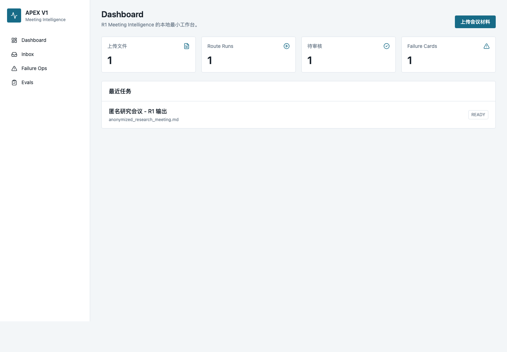
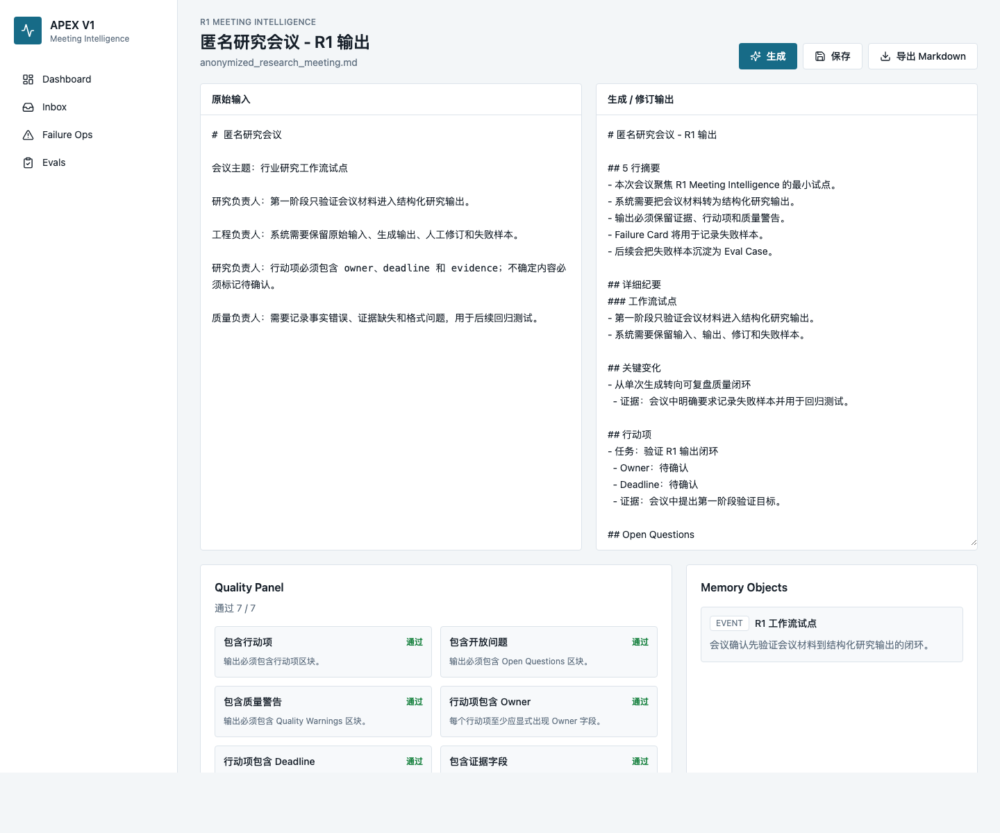
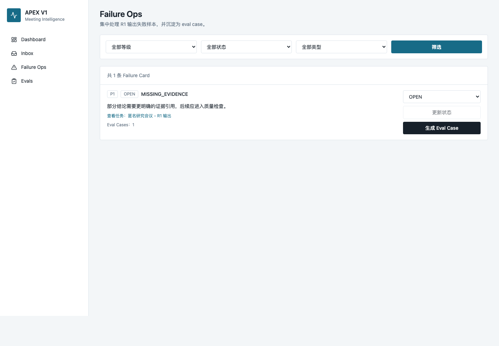
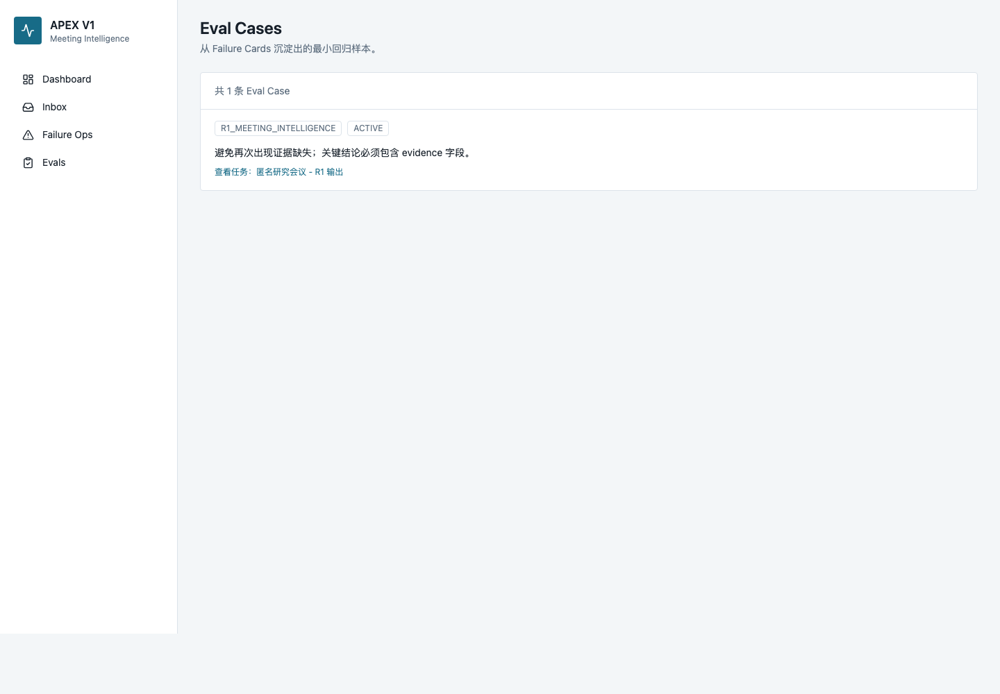
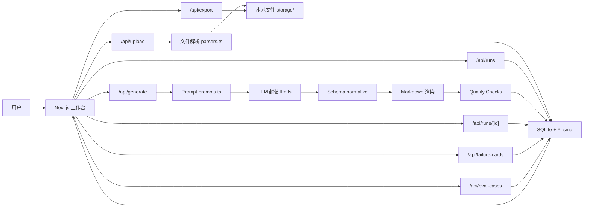

# APEX V1

APEX V1 是一个面向高价值研究与决策工作的 Research OS 原型。当前版本先聚焦 `R1 Meeting Intelligence`：把会议材料从“被动记录”转成可复盘、可追踪、可改进的结构化研究工作流。

本仓库中的示例、截图、文件名和说明均使用匿名数据，不包含具体个人姓名、真实客户名称、会议原文或敏感业务资料。

## 为什么要做这个系统

研究型团队的核心问题通常不是“缺少信息”，而是：

- 信息分散在会议、文档、财报、网页、聊天和个人笔记里。
- 会议纪要经常停留在总结层，无法直接进入后续研究动作。
- 重要判断缺少证据回链，后续难以复盘。
- AI 输出看起来完整，但错误、遗漏和用户修订没有被系统化沉淀。
- 每次工作都像重新开始，机构记忆没有形成复利。

APEX V1 要解决的第一件事，是把一次会议变成一个可审计的研究对象：

```text
会议材料
-> 结构化输出
-> 人工修订
-> 行动项
-> 证据与质量检查
-> 失败样本
-> 记忆对象
-> 回归评测样本
```

这样，系统不是只“生成一份纪要”，而是在建立一条可持续改进的研究质量闭环。

## 客户是谁

当前假设客户是高频处理复杂信息、且对输出质量有明确要求的研究与决策团队：

- 投资研究团队。
- 家族办公室或资产配置团队。
- 企业战略、产业研究、并购或创新团队。
- 高管办公室或决策支持团队。
- 需要把会议、资料、观点和行动沉淀成组织记忆的小型专业服务团队。

这些客户的共同特征：

- 每周有大量会议和研究材料。
- 输出质量会影响真实判断。
- 需要保留证据、行动项和责任边界。
- 需要持续复盘失败，而不是只看单次 AI 输出。
- 愿意从低风险工作流开始试用 AI 系统。

## 为什么先做 R1 Meeting Intelligence

V1 没有先做完整平台，而是先做会议智能工作流，原因有三点：

1. 会议是高频入口  
   大量研究判断、客户反馈、项目推进和行动项都从会议产生。

2. 会议容易获得真实样本  
   相比财报、内部数据库或复杂检索，会议转录更容易用于早期验证。

3. 会议天然适合建立质量闭环  
   会议材料可以同时验证摘要、证据、行动项、开放问题、用户修订和失败样本记录。

因此，R1 是 APEX 的第一个 wedge：先把会议材料变成结构化研究对象，再向 Research Desk、Earnings Workflow 和 Decision Brief 扩展。

## 为什么要做这些功能

| 功能 | 为什么需要 |
| --- | --- |
| 文件上传与解析 | 将会议转录、Markdown、DOCX 等材料统一进入系统 |
| R1 RouteRun | 把一次会议处理过程变成可追踪任务，而不是一次性聊天 |
| 结构化输出 | 固定输出摘要、详细纪要、关键变化、行动项、开放问题、质量警告 |
| 人工编辑 | 保留 human-in-the-loop，避免把 AI 输出直接当最终事实 |
| Markdown 导出 | 让输出能进入真实工作文档和后续汇报 |
| Quality Panel | 自动检查输出是否包含行动项、开放问题、质量警告和证据字段 |
| Failure Card | 把事实错误、证据缺失、风险遗漏等失败记录下来 |
| Memory Object | 把会议中可复用的信息沉淀为组织记忆 |
| Eval Case | 将失败样本转成后续回归测试的候选样本 |
| Failure Ops 页面 | 集中管理失败样本，形成质量运营工作台 |

## 界面截图

以下截图均为匿名 demo 数据。

### Dashboard



Dashboard 用来查看系统整体状态，包括上传文件数、任务数、待审核任务、失败样本和最近任务。

### R1 任务详情



任务详情页展示原始输入、生成/修订输出、质量检查和 Memory Objects，是当前版本的核心工作台。

### Failure Ops



Failure Ops 用来集中查看、筛选和处理失败样本，并将失败样本转成 Eval Case。

### Eval Cases



Eval Cases 是从 Failure Card 中沉淀出的最小回归测试资产。

## 当前产品闭环

```text
上传会议材料
-> 创建 R1 任务
-> 生成结构化会议研究输出
-> 人工编辑修订
-> 保存修订
-> 导出 Markdown
-> 创建 Failure Card
-> 写入 Memory Object
-> 生成 Eval Case
```

没有配置 `OPENAI_API_KEY` 时，系统会返回本地占位输出，方便验证完整流程。

## 系统设计

### 总体架构



### 数据对象

| 对象 | 作用 |
| --- | --- |
| `SourceFile` | 保存上传文件和解析后的文本 |
| `RouteRun` | 保存一次 R1 工作流任务 |
| `MemoryObject` | 保存从会议中沉淀出的可复用记忆 |
| `FailureCard` | 保存失败样本、用户修订和问题描述 |
| `EvalCase` | 保存从失败样本转化出的回归测试候选 |

### 页面结构

| 页面 | 路径 | 作用 |
| --- | --- | --- |
| Dashboard | `/dashboard` | 查看整体状态和最近任务 |
| Inbox | `/inbox` | 上传材料并创建 R1 任务 |
| Run Detail | `/runs/[id]` | 生成、编辑、导出、记录失败、查看质量检查 |
| Memory Library | `/memory` | 跨会议浏览和筛选沉淀出的 Memory Objects |
| Failure Ops | `/failure-ops` | 集中管理 Failure Cards |
| Evals | `/evals` | 查看 Eval Cases |

## 技术栈

| 模块 | 技术 | 说明 |
| --- | --- | --- |
| Web 框架 | Next.js 15 App Router | 页面、API Route、服务端渲染 |
| 前端 | React 19 + TypeScript | 工作台交互 |
| 样式 | Tailwind CSS | 简洁、可维护的界面样式 |
| 图标 | lucide-react | 导航和操作按钮图标 |
| ORM | Prisma Client | 数据访问 |
| 数据库 | SQLite | MVP 本地存储 |
| LLM SDK | openai | 调用模型生成 R1 输出 |
| DOCX 解析 | mammoth | 从 `.docx` 中抽取文本 |
| 测试脚本 | tsx | 执行本地 smoke test |
| 文件存储 | 本地 `storage/` | 保存上传文件和导出文件 |

## 实现方式

### 上传与解析

用户在 Inbox 上传 `.txt`、`.md` 或 `.docx`。系统将原始文件保存到 `storage/uploads`，并将解析后的文本写入 `SourceFile.textContent`。

对应代码：

- `app/api/upload/route.ts`
- `components/FileUploader.tsx`
- `lib/parsers.ts`

### 生成与结构化

用户点击“生成”后，系统读取 `RouteRun.inputText`，构造 R1 prompt，调用 LLM 或本地占位输出。生成结果会被 normalize 成固定 schema，再渲染为 Markdown。

对应代码：

- `app/api/generate/route.ts`
- `lib/prompts.ts`
- `lib/llm.ts`
- `lib/meeting.ts`
- `lib/markdown.ts`

### 质量检查

生成后系统自动运行基础检查，包括：

- 是否包含行动项。
- 是否包含 Open Questions。
- 是否包含 Quality Warnings。
- 行动项是否有 Owner。
- 行动项是否有 Deadline。
- 是否包含证据字段。
- 输出长度是否合理。

对应代码：

- `lib/quality.ts`
- `components/RunEditor.tsx`

### 失败样本与评测样本

用户可以把输出问题记录为 Failure Card，并在 Failure Ops 页面将其转成 Eval Case。Eval Case 是后续自动回归测试的基础。

对应代码：

- `app/api/failure-cards/route.ts`
- `app/api/failure-cards/[id]/route.ts`
- `app/api/eval-cases/route.ts`
- `app/failure-ops/page.tsx`
- `app/evals/page.tsx`

## 本地使用方式

### 1. 安装依赖

```bash
npm install
```

### 2. 配置环境变量

复制 `.env.example`：

```bash
cp .env.example .env.local
cp .env.example .env
```

默认配置：

```bash
DATABASE_URL="file:./dev.db"
OPENAI_API_KEY=""
OPENAI_MODEL="gpt-4o-mini"
FILE_STORAGE_PATH="./storage"
```

说明：

- `OPENAI_API_KEY` 留空时，系统使用本地占位输出。
- 配置 `OPENAI_API_KEY` 后，系统会调用模型生成真实 R1 输出。

### 3. 初始化数据库

```bash
npm run db:generate
sqlite3 prisma/dev.db < prisma/init.sql
```

### 4. 启动开发服务

```bash
npm run dev
```

打开：

```text
http://localhost:3000
```

### 5. 运行冒烟测试

需要先启动 `npm run dev`。

```bash
npm run test:smoke
```

## 当前开发进度

### 已发布版本：V1.0.0

V1.0.0 已完成并发布：

- R1 Meeting Intelligence MVP。
- 上传 `.txt`、`.md`、`.docx`。
- 创建 R1 RouteRun。
- 生成结构化 Markdown 输出。
- 人工编辑与保存。
- Markdown 导出。
- Failure Card 创建。
- Dashboard、Inbox、Run Detail 页面。

### 当前开发版本：V1.1 Quality Loop

V1.1 已完成第一轮开发：

- R1 JSON schema normalize。
- 自动 Quality Checks。
- Memory Candidates 写入 `MemoryObject`。
- 独立 Failure Ops 页面。
- 独立 Evals 页面。
- Failure Card 状态更新。
- Failure Card 转 Eval Case。
- 本地 smoke test。
- 匿名截图和脱敏 README。

## 里程碑

| 里程碑 | 状态 | 说明 |
| --- | --- | --- |
| M0 产品定义 | 已完成 | 明确先做 R1 Meeting Intelligence |
| M1 V1 MVP | 已发布 | 上传、生成、编辑、导出、Failure Card 闭环 |
| M2 V1.1 Quality Loop | 进行中 | 质量检查、Memory、Failure Ops、Eval Case |
| M3 R1 可试用版 | 下一步 | 真实 API Key 下稳定输出，增加更多匿名样本回归 |
| M4 Evidence Layer | 计划中 | 更细证据回链、引用检查、结构化 Evidence |
| M5 Research Desk | 计划中 | 启动 R3 Research Desk，支持资料包和研究问题 |
| M6 Pilot Readiness | 计划中 | 面向设计伙伴的小范围低风险试用 |

## 整体开发计划

### 阶段 1：R1 最小闭环

目标：证明系统能把会议材料转成结构化研究输出。

结果：已完成并发布为 `v1.0.0`。

### 阶段 2：质量闭环

目标：让 R1 输出可以被连续使用、复盘和改进。

当前状态：正在开发，核心能力已合入主分支。`v0.1.1` 已补齐 Failure Card 生成 Eval Case 的幂等保护，避免重复沉淀相同回归样本。`v0.1.2` 增加 Eval Cases 状态筛选和状态更新，让回归样本池可以运营。`v0.1.3` 在 Dashboard 增加质量健康指标，让阻断质量项、Open Failure 和 Active Eval 可以一屏看到。`v0.1.4` 增加 Memory Library，让会议中沉淀出的组织记忆可以跨任务浏览。

重点：

- 更稳定的结构化输出。
- 自动质量检查。
- Failure Ops。
- Eval Case。
- Memory Object。

### 阶段 3：证据层

目标：让关键结论都有可追踪证据。

计划功能：

- Evidence 对象。
- 引用位置。
- 证据完整性检查。
- 结论和证据的关联视图。

### 阶段 4：Research Desk

目标：从会议入口扩展到研究资料工作台。

计划功能：

- PDF 和 DOCX 资料包解析。
- 简单检索。
- 研究问题回答。
- 观点、反方、下一步研究问题。

### 阶段 5：设计伙伴试点

目标：进入低风险真实工作流。

前置条件：

- R1 在匿名样本和内部样本中稳定。
- Failure Ops 能记录并修复主要问题。
- Eval Cases 能形成基础回归集。
- 输出可以进入真实工作文档。

## 安全与脱敏约定

- README 和截图只使用匿名 demo 数据。
- 示例会议不包含具体个人姓名。
- `.env`、`.env.local` 不进入 Git。
- `prisma/dev.db` 不进入 Git。
- `storage/uploads` 和 `storage/exports` 下的真实文件不进入 Git。
- 提交前必须确认没有真实客户名称、真实会议内容、API Key 或内部 TODO。

## 常用命令

```bash
npm install
npm run db:generate
sqlite3 prisma/dev.db < prisma/init.sql
npm run dev
npm run build
npm run test:smoke
```

## 相关文档

- [DEVELOPMENT_PLAN.md](DEVELOPMENT_PLAN.md)
- [NEXT_VERSION_DEVELOPMENT_PLAN.md](NEXT_VERSION_DEVELOPMENT_PLAN.md)
- [docs/development-log.md](docs/development-log.md)
