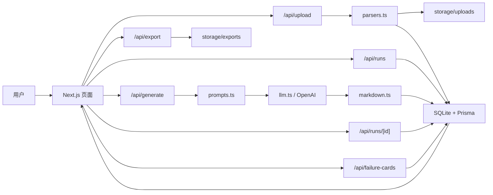

# APEX V1

APEX V1 是 APEX Research OS 的第一个最小可运行版本，当前只聚焦一条核心路线：`R1 Meeting Intelligence`。

它的目标不是做一个完整平台，而是先把最重要的产品闭环跑通：

```text
上传会议材料
-> 创建 R1 任务
-> 生成结构化会议研究输出
-> 人工编辑修订
-> 导出 Markdown
-> 记录 Failure Card
```

即使没有配置大模型 API Key，系统也会返回本地占位输出，方便先测试上传、任务、编辑、导出和失败样本记录的完整链路。

## 当前功能

- 上传 `.txt`、`.md`、`.docx` 会议材料。
- 自动解析文本内容并保存为 `SourceFile`。
- 从上传文件创建 `R1_MEETING_INTELLIGENCE` 任务。
- 调用 LLM 生成结构化会议纪要。
- 将 LLM JSON 输出渲染为 Markdown。
- 支持用户在线编辑生成结果。
- 支持保存修订后的 Markdown。
- 支持导出 Markdown 文件到本地。
- 支持创建 Failure Card，记录事实错误、证据缺失、引用错误、风险遗漏、格式错误等质量问题。
- 支持独立 `Failure Ops` 页面筛选、处理失败样本。
- 支持从 Failure Card 生成 Eval Case。
- 支持将 `memoryCandidates` 写入 `MemoryObject`。
- 支持基础 Quality Checks 和 smoke test。
- Dashboard 展示上传文件数、任务数、待审核任务数、Failure Card 数和最近任务。

## 产品边界

当前版本主线仍只做 R1，不做完整 Research OS。

已实现：

- R1 Meeting Intelligence
- 单 workspace 本地使用
- 本地 SQLite 数据库
- 本地文件存储
- 本地 Markdown 导出
- 最小 Failure Ops
- Memory Object 写入
- Eval Case 最小闭环

暂不实现：

- 音频自动转写
- PDF 解析
- R2 Earnings Workflow
- R3 Research Desk
- 多用户、多 workspace 权限
- pgvector 检索
- 生产部署
- 飞书、Slack、邮箱等外部系统集成

## 技术栈

| 模块 | 技术 | 作用 |
| --- | --- | --- |
| Web 框架 | Next.js 15 App Router | 页面、API Route、服务端渲染 |
| 前端 | React 19 + TypeScript | 页面交互与状态管理 |
| 样式 | Tailwind CSS | 快速构建简洁工作台 UI |
| 图标 | lucide-react | 导航、按钮和状态图标 |
| ORM | Prisma Client | 访问 SQLite 数据库 |
| 数据库 | SQLite | MVP 本地数据存储 |
| LLM SDK | openai | 调用 OpenAI 模型生成 R1 输出 |
| DOCX 解析 | mammoth | 从 `.docx` 中抽取纯文本 |
| 文件存储 | 本地 `storage/` | 保存上传文件和导出 Markdown |

## 架构图



## 核心数据流

### 1. 上传会议材料

用户在 `Inbox` 上传 `.txt`、`.md` 或 `.docx` 文件。

对应代码：

- 页面：[app/inbox/page.tsx](app/inbox/page.tsx)
- 组件：[components/FileUploader.tsx](components/FileUploader.tsx)
- API：[app/api/upload/route.ts](app/api/upload/route.ts)
- 解析：[lib/parsers.ts](lib/parsers.ts)

处理逻辑：

1. 前端用 `FormData` 上传文件。
2. `/api/upload` 调用 `parseUploadedFile`。
3. `.docx` 用 `mammoth.extractRawText` 解析。
4. `.txt` 和 `.md` 直接按 UTF-8 读取。
5. 原始文件保存到 `storage/uploads`。
6. 解析文本写入 `SourceFile.textContent`。

### 2. 创建 R1 任务

用户在 `Inbox` 从某个上传文件创建 R1 任务。

对应代码：

- API：[app/api/runs/route.ts](app/api/runs/route.ts)
- 数据模型：`RouteRun`

处理逻辑：

1. 读取 `sourceFileId`。
2. 从 `SourceFile` 取出 `textContent`。
3. 创建一条 `RouteRun`。
4. `routeType` 固定为 `R1_MEETING_INTELLIGENCE`。
5. 跳转到 `/runs/[id]`。

### 3. 生成结构化会议输出

用户在任务详情页点击“生成”。

对应代码：

- 页面组件：[components/RunEditor.tsx](components/RunEditor.tsx)
- API：[app/api/generate/route.ts](app/api/generate/route.ts)
- Prompt：[lib/prompts.ts](lib/prompts.ts)
- LLM 封装：[lib/llm.ts](lib/llm.ts)
- Markdown 渲染：[lib/markdown.ts](lib/markdown.ts)

处理逻辑：

1. `/api/generate` 将任务状态改为 `GENERATING`。
2. `generateMeetingOutput` 读取 `RouteRun.inputText`。
3. 如果没有配置 `OPENAI_API_KEY`，返回本地占位输出。
4. 如果配置了 `OPENAI_API_KEY`，调用 OpenAI 生成 JSON。
5. `safeJsonParse` 解析模型 JSON。
6. `renderMeetingMarkdown` 渲染为 Markdown。
7. 保存到 `generatedOutput` 和 `editedOutput`。
8. 写入基础 `qualityJson`。
9. 状态改为 `READY`。

## R1 输出格式

LLM 被要求返回 JSON，再由系统渲染为 Markdown。

目标 JSON 结构：

```json
{
  "title": "会议标题",
  "fiveLineSummary": ["..."],
  "detailedNotes": [
    {
      "topic": "主题",
      "points": ["..."]
    }
  ],
  "keyChanges": [
    {
      "change": "...",
      "evidence": "..."
    }
  ],
  "actionItems": [
    {
      "task": "...",
      "owner": "待确认",
      "deadline": "待确认",
      "evidence": "..."
    }
  ],
  "openQuestions": ["..."],
  "memoryCandidates": [
    {
      "type": "EVENT",
      "title": "...",
      "content": "..."
    }
  ],
  "qualityWarnings": ["..."]
}
```

关键规则：

- 行动项必须包含 `task`、`owner`、`deadline`、`evidence`。
- 如果材料中没有 owner 或 deadline，必须标记为 `待确认`。
- 不能编造事实。
- 不确定的内容必须进入 `qualityWarnings`。
- 重要判断要尽量附带证据。

## 页面说明

### Dashboard

路径：`/dashboard`

作用：

- 查看上传文件总数。
- 查看 RouteRun 总数。
- 查看待审核任务数。
- 查看 Failure Card 总数。
- 查看最近 5 个任务。

对应代码：

- [app/dashboard/page.tsx](app/dashboard/page.tsx)

### Inbox

路径：`/inbox`

作用：

- 上传会议材料。
- 查看最近上传文件。
- 查看文本预览。
- 从上传文件创建 R1 任务。

对应代码：

- [app/inbox/page.tsx](app/inbox/page.tsx)
- [components/FileUploader.tsx](components/FileUploader.tsx)

### Run Detail

路径：`/runs/[id]`

作用：

- 左侧查看原始会议输入。
- 右侧查看和编辑生成输出。
- 触发生成。
- 保存修订。
- 导出 Markdown。
- 创建 Failure Card。
- 查看基础 Quality Panel。

对应代码：

- [app/runs/[id]/page.tsx](app/runs/[id]/page.tsx)
- [components/RunEditor.tsx](components/RunEditor.tsx)

## API 说明

| API | 方法 | 作用 |
| --- | --- | --- |
| `/api/upload` | `POST` | 上传并解析会议材料 |
| `/api/runs` | `POST` | 从上传文件创建 R1 任务 |
| `/api/runs/[id]` | `PATCH` | 保存用户修订后的 Markdown |
| `/api/generate` | `POST` | 生成 R1 结构化会议输出 |
| `/api/failure-cards` | `POST` | 创建 Failure Card |
| `/api/failure-cards/[id]` | `PATCH` | 更新 Failure Card 状态 |
| `/api/eval-cases` | `POST` | 从 Failure Card 创建 Eval Case |
| `/api/export` | `POST` | 导出 Markdown 到 `storage/exports` |

## 数据模型

数据库 schema 位于：[prisma/schema.prisma](prisma/schema.prisma)

### SourceFile

上传文件及解析文本。

字段：

- `id`
- `filename`
- `mimeType`
- `path`
- `textContent`
- `createdAt`

### RouteRun

一次 R1 任务运行。

字段：

- `id`
- `routeType`
- `title`
- `status`
- `sourceFileId`
- `inputText`
- `generatedOutput`
- `editedOutput`
- `qualityJson`
- `createdAt`
- `updatedAt`

状态说明：

- `DRAFT`：已创建，尚未生成。
- `GENERATING`：正在生成。
- `READY`：已生成，待审核。
- `REVIEWED`：用户已保存修订。

### FailureCard

记录输出失败、用户修订和质量问题。

字段：

- `id`
- `routeRunId`
- `failureType`
- `severity`
- `description`
- `originalOutput`
- `userRevision`
- `status`
- `createdAt`

严重等级：

- `P0`：泄密、越权、严重误导等阻断级问题。
- `P1`：关键事实错误、关键风险遗漏、引用错误。
- `P2`：结构、格式、可用性问题。
- `P3`：轻微表达或偏好问题。

### MemoryObject

当前是轻量预留模型，用于后续从 R1 输出中沉淀公司、人物、事件、观点和行动。

字段：

- `id`
- `type`
- `title`
- `content`
- `routeRunId`
- `createdAt`

### EvalCase

从 Failure Card 生成的最小回归样本。

字段：

- `id`
- `routeRunId`
- `failureCardId`
- `routeType`
- `inputText`
- `expectedBehavior`
- `scoringRubricJson`
- `status`
- `createdAt`

## 目录结构

```text
apex-v1/
  app/
    api/
      export/
      failure-cards/
      generate/
      runs/
      upload/
    dashboard/
    evals/
    failure-ops/
    inbox/
    runs/
    globals.css
    layout.tsx
    page.tsx
  components/
    AppShell.tsx
    FileUploader.tsx
    RunEditor.tsx
  lib/
    db.ts
    llm.ts
    markdown.ts
    parsers.ts
    prompts.ts
  prisma/
    init.sql
    schema.prisma
  samples/
    sample_meeting.md
  scripts/
    smoke-test.ts
  storage/
    uploads/
    exports/
  DEVELOPMENT_PLAN.md
  README.md
```

## 本地运行

### 1. 安装依赖

```bash
npm install
```

### 2. 配置环境变量

复制 `.env.example` 为 `.env.local` 和 `.env`。

```bash
cp .env.example .env.local
cp .env.example .env
```

默认配置：

```bash
DATABASE_URL="file:./dev.db"
OPENAI_API_KEY=""
OPENAI_MODEL="gpt-4o-mini"
FILE_STORAGE_PATH="./storage"
```

说明：

- `OPENAI_API_KEY` 留空时，系统使用本地占位输出。
- 配置 `OPENAI_API_KEY` 后，系统会调用 OpenAI 生成真实 R1 输出。

### 3. 生成 Prisma Client

```bash
npm run db:generate
```

### 4. 初始化 SQLite 数据库

当前环境中 `prisma db push` 可能因为 Prisma schema engine 问题失败，所以项目提供了手动初始化 SQL：

```bash
sqlite3 prisma/dev.db < prisma/init.sql
```

### 5. 启动开发服务

```bash
npm run dev
```

打开：

```text
http://localhost:3000
```

## 使用流程

### 方式一：使用示例会议材料

项目内置一个示例文件：

```text
samples/sample_meeting.md
```

操作步骤：

1. 打开 `http://localhost:3000/inbox`。
2. 上传 `samples/sample_meeting.md`。
3. 在上传记录中点击“创建 R1”。
4. 进入任务详情页后点击“生成”。
5. 在右侧编辑生成结果。
6. 点击“保存”。
7. 点击“导出 Markdown”。
8. 如发现问题，在 Failure Card 区域记录失败样本。

### 方式二：使用真实会议转录

准备 `.txt`、`.md` 或 `.docx` 文件，内容建议包括：

- 会议主题。
- 参会人。
- 时间。
- 讨论内容。
- 明确或隐含的行动项。
- 需要后续追问的问题。

上传后按同样流程创建 R1 任务。

## 导出文件

导出的 Markdown 会保存到：

```text
storage/exports/
```

浏览器也会触发文件下载。

上传原始文件会保存到：

```text
storage/uploads/
```

这两个目录下的真实文件默认不纳入 Git。

## 质量机制

当前版本的质量机制是最小实现。

已实现：

- 输出中固定包含 `行动项`、`Open Questions`、`Quality Warnings`。
- 生成后写入基础 `qualityJson`。
- 用户可以手动创建 Failure Card。
- Failure Card 会保存原始输出和用户修订。

后续应增强：

- 自动检查行动项是否缺 owner / deadline。
- 自动检查关键结论是否缺证据。
- 自动检查 Markdown 结构完整性。
- 从 Failure Card 自动生成 eval case。
- 每次 prompt 或模型变更后跑回归测试。

## 安全与脱敏

当前版本是本地 MVP，不建议直接上传敏感生产资料到未受控环境。

注意事项：

- `.env` 和 `.env.local` 已被 `.gitignore` 忽略。
- `storage/uploads` 和 `storage/exports` 下的真实文件已被 `.gitignore` 忽略。
- SQLite 本地数据库 `prisma/dev.db` 已被 `.gitignore` 忽略。
- 提交代码前应确认没有真实客户文件、API Key、会议原文或内部 TODO 被加入 Git。

## 常用命令

```bash
# 启动开发服务
npm run dev

# 生产构建检查
npm run build

# 本地冒烟测试，需要先启动 npm run dev
npm run test:smoke

# 生成 Prisma Client
npm run db:generate

# 手动初始化 SQLite 表
sqlite3 prisma/dev.db < prisma/init.sql
```

## 当前验证状态

已验证：

- `npm run build` 通过。
- `/dashboard` 返回 200。
- `/inbox` 返回 200。
- `/runs/[id]` 返回 200。
- 上传样例 Markdown 成功。
- 创建 R1 任务成功。
- 生成占位输出成功。
- 保存修订成功。
- 创建 Failure Card 成功。
- 导出 Markdown 成功。

## 下一步开发

建议按以下顺序继续：

1. 接入真实 `OPENAI_API_KEY` 测试 R1 输出质量。
2. 优化 Prompt，让输出更稳定地满足 JSON schema。
3. 增加自动质量检查：行动项、证据、开放问题、质量警告。
4. 建立独立 Failure Ops 页面。
5. 将 `memoryCandidates` 真正写入 `MemoryObject`。
6. 增加 PDF 解析。
7. 增加音频转写。
8. 开始 R3 Research Desk。
9. 再进入 R2 Earnings Workflow。

## 开发计划

完整开发计划见：

- [DEVELOPMENT_PLAN.md](DEVELOPMENT_PLAN.md)
